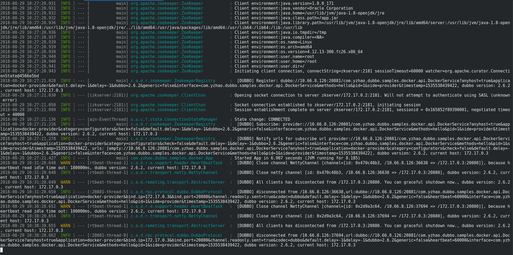

Some deployment scenarios need to dynamically specify the address of service registration. For example, docker bridge network mode need to specify a registered host IP for external network communication. Dubbo provides two pairs of system attributes in the startup phase, which are used to set the IP and port addresses of external communication. 
* DUBBO_IP_TO_REGISTRY --- Registering to the IP address of the registration center  
* DUBBO_PORT_TO_REGISTRY --- Registering to the port of the registration center 
* DUBBO_IP_TO_BIND --- Listening IP addresses  
* DUBBO_PORT_TO_BIND --- Listening ports 

> 1. The above four configurations are optional. Dubbo will automatically get IP and port if there is no configuration. Please choose them flexibly according to deployment scenarios. 
> 2. Dubbo supports multi-protocol. **If an application exposes multiple different protocol services simultaneously and need to specify IP or port separately for each service. Please add the protocol prefix before the above attributes separately.** For example:
> * HESSIAN_DUBBO_PORT_TO_BIND    hessian protocol bound port
> * DUBBO_DUBBO_PORT_TO_BIND      dubbo protocol bound port
> * HESSIAN_DUBBO_IP_TO_REGISTRY  hessian protocol registered IP
> * DUBBO_DUBBO_IP_TO_REGISTRY      dubbo protocol registered IP
> 3. `PORT_TO_REGISTRY` or `IP_TO_REGISTRY`won’t be used as default `PORT_TO_BIND` or `IP_TO_BIND`，But the reverse is true.
> * If set`PORT_TO_REGISTRY=20881` `IP_TO_REGISTRY=30.5.97.6`，then `PORT_TO_BIND` `IP_TO_BIND`won’t be affected.
> * If set`PORT_TO_BIND=20881` `IP_TO_BIND=30.5.97.6`，then `PORT_TO_REGISTRY=20881` `IP_TO_REGISTRY=30.5.97.6` by default.
> 

[dubbo-docker-sample](https://github.com/dubbo/dubbo-samples) local operation process： 
 
1. clone project to local
```sh
git clone git@github.com:dubbo/dubbo-samples.git
cd dubbo-samples/dubbo-samples-docker
```
2. package local maven
```sh
mvn clean install  
```
3. build a mirror by docker build
```sh
docker build --no-cache -t dubbo-docker-sample . 
```
Dockerfile
```sh
FROM openjdk:8-jdk-alpine
ADD target/dubbo-docker-sample-0.0.1-SNAPSHOT.jar app.jar
ENV JAVA_OPTS=""
ENTRYPOINT exec java $JAVA_OPTS -jar /app.jar
```
4. Create and run containers from mirroring
```sh
# Since we use the zk registration center, we start zk container first
docker run --name zkserver --restart always -d zookeeper:3.4.9
```
```sh
docker run -e DUBBO_IP_TO_REGISTRY=30.5.97.6 -e DUBBO_PORT_TO_REGISTRY=20881 -p 30.5.97.6:20881:20880 --link zkserver:zkserver -it --rm dubbo-docker-sample
```

> Suppose the host IP is 30.5.97.6.    
> set the provider to register the IP address and port of the registration center by environment variables `DUBBO_IP_TO_REGISTRY=30.5.97.6` `DUBBO_PORT_TO_REGISTRY=20881`    
> Implement the port mapping by`-p 30.5.97.6:20881:20880`, where 20800 is the listening port automatically selected by dubbo. There is no monitoring IP configuration, so it will listen 0.0.0.0 (all IP).
> After startup, the registered address of provider is 30.5.97.6:20881, and the listening address of the container is: 0.0.0.0:20880 

5. Test
Execute from another host or container
```sh
telnet 30.5.97.6 20881
ls
invoke com.alibaba.dubbo.test.docker.DemoService.hello("world")
```

Docker-provider


Invoke-service
